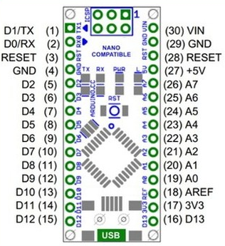

# NeoLampe

Here is a 3D printed bed lamp that allows simple colored lightning as well as some animations. It's based on an arduino nano and a AdaFruit NeoPixel ring.

The arduino firmware can be easily compiled with vscode/platformIO. It uses the adafruit arduino library that should be fetched automaticaly by platformIO. 2 firmwares are available in the firmware folder.

You'll also need a 10K linear potentiometre, a push button, and optionnaly a USB socket and a power switch to be able to easily switch off the lap. 
 
* Press the push button to cycle through the 5 animation modes
* Use the pot to modify the color or animation speed (depends on the mode)
* Hold down the button and turn the pot to adjust the brightness
* Press one second the push button to save the current animation. It will be then reloaded next time you switch the lamp on.

The wiring :  
* A0 : middle pin of the pot
* A1 : GND of the pot
* A2 : 3rd pot pins
* A3/A4 : the 2 pins of the push button
* A5 : The neopixel pins

 
I used 29/GND and 30/VIN to power the arduino so that i could insert a power switch between the accessible USB socket and the inner arduino. 
I wired the GND and 5V of the NeoPixel ring to the ICSP GND and 5V, so that the NeoPixel is also switch off by the power switch  

 

