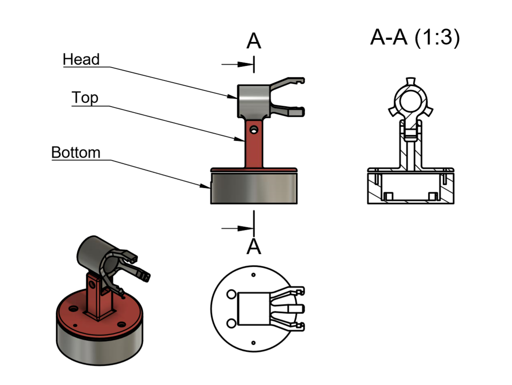

# NeoLampe

This lamp allows simple colored lightning as well as some animation.

It's based on a NeoPixel ring and an Arduino nano. I used cheap emakefun nano for the 5 NeoLamps i built as christmast presents.

You'll also need a power switch, a variable resistor 10K linear, and a push button.

The arduino firmware be easily compiled in vscode/platformIO.

