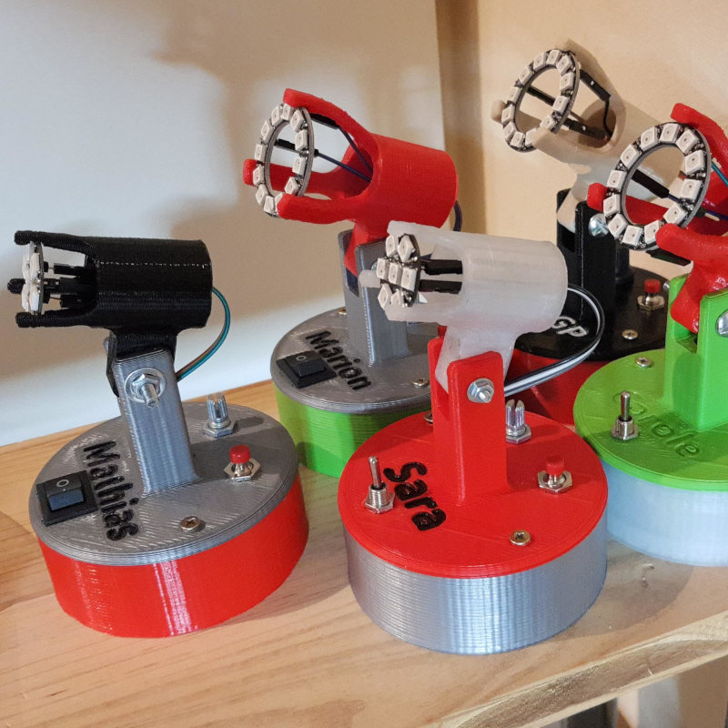

# NeoLampe

Here is a bed lamp that allows simple colored lightning as well as some animation based on an arduino nano and a AdaFruit NeoPixel ring.

The arduino firmware can be easily compiled with vscode/platformIO. It uses the adafruit arduino library that should be fetched automaticaly by platformIO.

(I used cheap emakefun 328p nano clone for the 5 NeoLamps I built for christmass)

You'll also need a variable resistor 10K linear, a push button, and optionnaly a USB socket and a power switch to be able to easily switch off the lap. 
 
. Press the push button to cycle through the 5 animation modes  
. Use the pot to modify the color or animation speed (depends on the mode) 
. Hold down the button and turn the pot to adjust the brightness  
. Press one second the push button to save the current animation. It will be then reloaded next time you switch the lamp on. 

The wiring :  
A0 : middle pin of the pot 
A1 : GND of the pot 
A2 : 3rd pot pins 
A3/A4 : the 2 pins of the push button 
A5 : The neopixel pins 
 
I used 29/GND and 30/VIN to power the arduino so that i could insert a power switch between the accessible USB socket and the inner arduino. 
I wired the GND and 5V of the NeoPixel ring to the ICSP GND and 5V, so that the NeoPixel is also switch off by the power switch  

 

